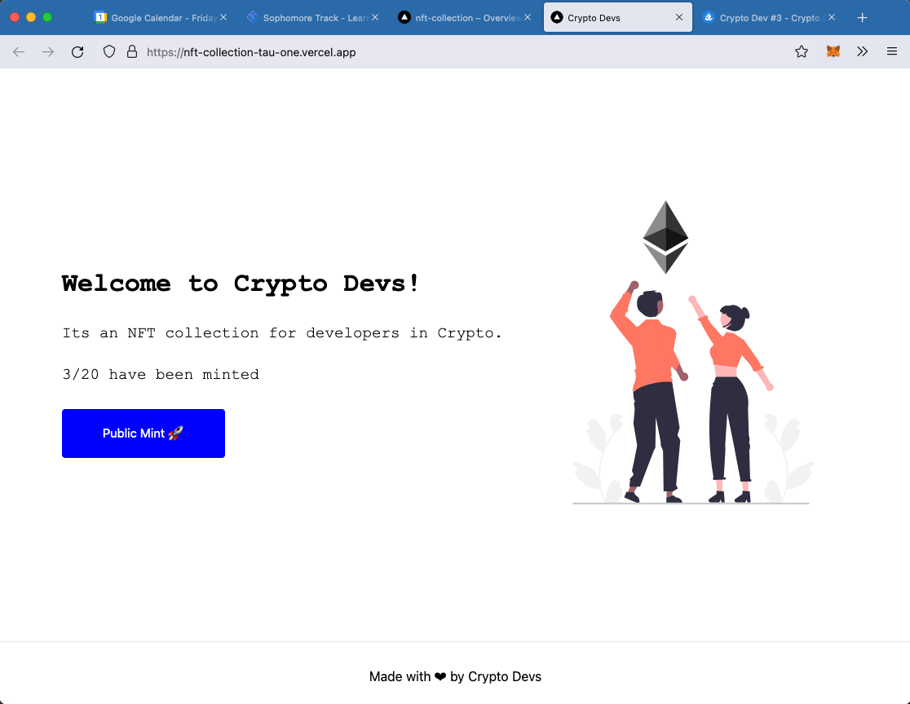
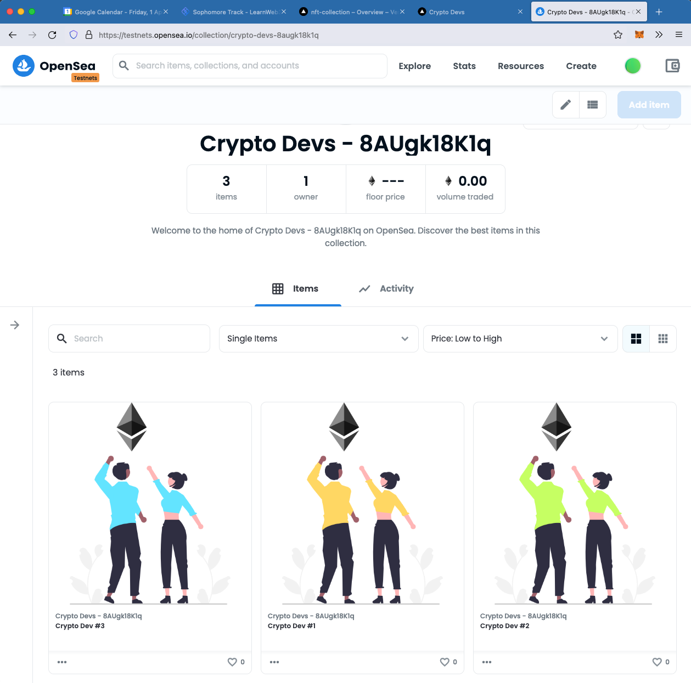

# NFT-Collection
Project following [LearnWeb3DAO Sophmore track](https://www.learnweb3.io/tracks/sophomore) to create the smart
contract, build a front-end, and deploy a NFT collection. This project builds upon the functionality
from [andy-shearer/whitelist-dapp](https://github.com/andy-shearer/whitelist-dapp) and allows a whitelist mint of a specified
duration (triggered by the owner of the contract), followed by a public mint.

Built using hardhat and next.js - see both README files in the relevant subdirectories 
([hardhat](./hardhat/README.md) / [next.js](./my-app/README.md))

Deployed to: https://nft-collection-tau-one.vercel.app/

NFT collection on OpenSea: https://testnets.opensea.io/collection/crypto-devs-8augk18k1q

